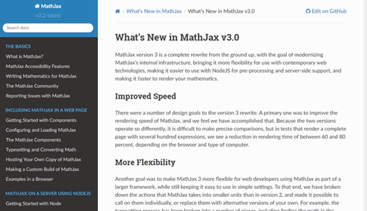
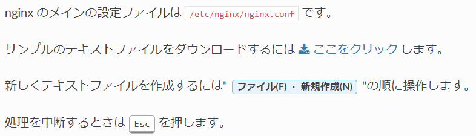

<style>
section {
  background:linear-gradient(to right, #2c4560, #23453b);
}
h1{
    position: absolute;
    left: 50px; top: 50px;
}
</style>

# Sphinx 入門

---

## マニュアル的なWebサイトを楽して作りたい......！

#### ついでにPDFにも出力できると嬉しい！

---


# [](https://www.sphinx-doc.org/ja/master/index.html) とは
\\

マークアップ言語 **reStructuredText** を用いてドキュメントを作成するツール

オンラインマニュアル作成によく利用されている


こういうやつ

---

# 環境構築

参考：https://zenn.dev/y_mrok/books/sphinx-no-tsukaikata/viewer/chapter4

1. 好きな方法でPython環境を構築する
2. `pip install -U Sphinx`で Sphinx を入れる

`pip show Sphinx` で情報が表示されればOK!

---

# まず動かす

1. `sphinx-quickstart`でプロジェクト作成
  - $\texttt{Separate source and build directories}$ を $\texttt{yes}$にするとソースファイルが散らばらないのでおすすめ
  - $\texttt{Project language}$ には $\texttt{ja}$ を設定できる

2. `make html` で $\texttt{\_build/html}$ 内にhtmlファイルが作られれば成功

---

# 構成

- 1つの rst ファイル → 1つのページ

```
.. toctree::

   ./chap1
   ./chap2
   ./chap3
```
のようにファイルを階層化できる。

---

# 記法

全体的にMarkdownよりも少し複雑

かわりにMarkdownより拡張性が高い

- 見出し：`h6`まで対応
- 番号付きリストだけでなく英字付きリストにも対応
- サイト内リンクやページ内リンクが貼れる


<!-- ---

# 記法

- **見出し** `#####` などをたくさん並べる
- **リスト** 先頭に `-`
- **番号付きリスト** 先頭に `#.`
- **画像** `.. image:: ファイル名`
- **リンク** `` `ここをクリック <https://sphinx-users.jp/index.html>` ``
  - URL をそのまま書いてもリンクが貼られる
- **サイト内リンク** ``:doc:`rstファイル名` ``
- **ページ内リンク**
  - ラベル： 見出しの直前に``.. _ラベル名: ``
  - ラベルへのリンク： ``:ref:`ラベル名` `` -->

---

# ロール
用途別に細かく用意されている

ファイル名、ダウンロード、メニューセレクション、キーボード、コマンド、GUI内文字列など

<!-- - **コマンド** ``:command:`ls` ``
- **メニューセレクション** ``:menuselection:`ファイル(F)  新規作成(N)  ``

- **キーボード** ``:kbd:`Esc` ``
- **GUI表示名** ``:guilabel:`OK` ``
- **ファイル名** ``:file:`/etc/nginx/nginx.conf` ``
- **ダウンロード** ``download:`ここをクリック <./sample.txt>` `` -->

テーマを変えると見た目が変わって楽しい



---

# PDF出力

- `make latexpdf` を実行する

---

# GitHub Pagesで公開する

`Makefile` 中で
- `@$(SPHINXBUILD) -M $@ "$(SOURCEDIR)" "$(BUILDDIR)" $(SPHINXOPTS) $(O)` の `-M` を `-b` に変える
- `BUILDDIR=docs` に設定する
- `docs` フォルダに　`.nojekyll` ファイルを追加（中身は空でOK）

pushしてGitHub Pagesの設定をよしなにすれば公開できる

---

# カスタマイズ

**見た目**：`conf.py` の `html_theme = 'alabaster'` の部分を編集する
テーマ一覧：[Sphinx Themes Gallery (sphinx-themes.org)](https://sphinx-themes.org/)
- `builtin` と書かれているものは追加インストールなしで利用可能

**数式**：MathJax3 が利用可能なので[physics パッケージを利用したり](https://zenn.dev/shotakaha/articles/9c5630ccc8089654f04c)数式にナンバリングしてリンクを貼ったりできる

**マークダウン**： [myst-parserを利用してmarkdownファイルもhtmlに変換できる](https://zenn.dev/y_mrok/books/sphinx-no-tsukaikata/viewer/chapter26)

<!-- ---

# Tips

- 見出しの文字数に対して見出しを囲う記号の文字数が少ないと警告される
- `:numbered:`の指定はtoctreeの一番上にひとつあれば十分 -->

---

# カスタマイズ - 自作

reStructuredText はPythonでhtmlに変換されている

`Directive` を継承して自分でclassを書くことで拡張機能が作れる

["Hello world" 拡張機能の開発](https://www.sphinx-doc.org/ja/master/development/tutorials/helloworld.html)

---

# 参考

- [Sphinx の使い方 (zenn.dev)](https://zenn.dev/y_mrok/books/sphinx-no-tsukaikata)
- [ようこそ! — Sphinx documentation (sphinx-doc.org)](https://www.sphinx-doc.org/ja/master/index.html)
